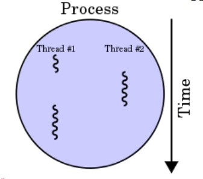
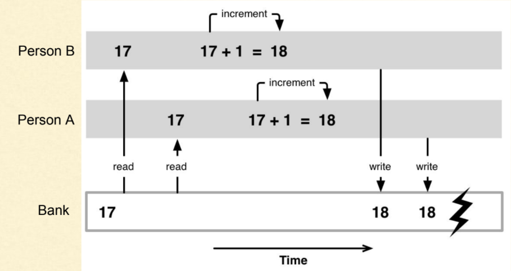
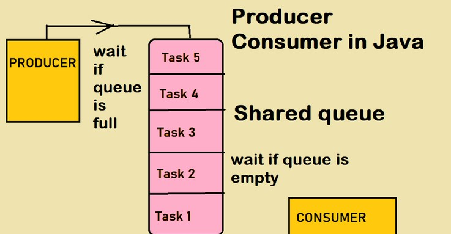

<!-- _class: title -->

# Concurrency and Multithreading in Java
<br/>

[Moeein Aali](https://github.com/MoeeinAali/)
Sharif University of Technology
CE244 - Advanced Programming - Fall 2024
Mr. Hamidreza Hosseinkhani

---

<!-- _class: tinytext -->

# Concurrency vs. Parallelism
<br/>


---

<!-- _class: tinytext -->

# Concurrency vs. Parallelism
<br/>


- Even without the ability to execute in parallel, the ability to concurrency is useful.

---

<!-- _class: tinytext -->

# Thread
<br/>

#### When a Java program runs:
- A **thread** is created to execute the `main()` method.

#### Key Points:
- The program can create new threads and execute them.
- Multiple threads run **concurrently**.
  - This can sometimes mean running **in parallel**.



---

<!-- _class: tinytext -->

# Thread: Create
<br/>

### Two primary ways to define the behavior of a new thread:
1. Create a class that **extends** `java.lang.Thread`.
2. Create a class that **implements** the `java.lang.Runnable` interface.


- Implement the `run` method in the new class.

---

<!-- _class: tinytext -->

# Thread: Create a class that extends `java.lang.Thread`
<br/>

```java
class MyThread extends Thread {
  @Override
  public void run() {
  System.out.println("Hello");
  System.out.println("Bye");
  }
}
```

```java
public class Main{
  public static void main(String[] args) {
    System.out.println("Salam");
    MyThread t = new MyThread();
    t.start();
    System.out.println("Khodahafez");
  }
}
```

---

<!-- _class: tinytext -->

# Thread: Implements the `java.lang.Runnable` interface
<br/>

```java
class MyRunnable implements Runnable{
  @Override
  public void run() {
    System.out.println("Hello");
    System.out.println("Bye");
  }
}
```
```java
Thread t = new Thread(new MyRunnable());
t.start();
```

---

# Which Approach is Better?

### Extending `Thread`:
- **Simpler implementation**.
- However, limits the class from **inheriting** from other classes.
  - A class cannot extend multiple classes in Java.

### Implementing `Runnable`:
- Provides more **flexibility**.
- Allows the class to extend a different class if needed.
- Commonly used in practice.

---

# Run vs. Start
</br>

### Why Implement `run` but Call `start`?
- The `start` method is a **special method** in the `Thread` class.
  - It performs low-level system operations to create a new thread.
  - Calls the `run` method **inside the new thread**.

- Directly calling `run`:
  - Executes the method like a **normal function call**.
  - Does **not** create a new thread.

---

# Thread Methods
</br>

- For every thread that executes, an object of the `Thread` class is created.
- Methods of the `Thread` object provide functionalities for the corresponding thread.

#### Some Methods of the `Thread` Class
- Common instance methods:
  - `run`, `start`, `getId`, `setPriority`, `setDaemon`, ...

---

# Thread Methods
</br>

#### Some Static Methods
- `currentThread`: Returns the currently executing thread.
- `sleep`: Puts the currently executing thread to sleep for a specified time.
  - This pauses its execution for the given duration and then resumes it.
- `join`: Sometimes, it is necessary for one thread to complete its work before another section of code can proceed.
```java
Thread myThread = new MyThread();
myThread.start();
func1();
myThread.join();
func2();
```

---
<!-- _class: tinytext --> 
# Thread Priority
</br>

- The priority of a thread is adjustable.
- It can be changed using the `setPriority` method.

#### Priority Levels
- Thread priority is a number between `1` and `10` that indicates the thread's importance.
- Higher-priority threads are given more execution time by the operating system.
  - Threads with higher priority are allocated more CPU time.

```java
MyThread thread = new MyThread();
thread.setPriority(Thread.MAX_PRIORITY);
thread.start();
```

```java
Thread.MIN_PRIORITY = 1;
Thread.NORM_PRIORITY = 5;
Thread.MAX_PRIORITY = 10;
```

---
# Daemon Threads
<br/>

- A special type of thread that runs in the background.
- Typically, they provide services to other threads and do not have independent meaning or purpose.
- The Garbage Collector (`GC`) is an example of a daemon thread.
- If only daemon threads remain alive in a program and all regular threads have finished, the JVM terminates the daemon threads and the program ends.
- Use the `setDaemon(boolean on)` method to mark a thread as either daemon (`true`) or regular (`false`).

```java
MyThread thread = new MyThread();
thread.setDaemon(true);
thread.start();
```
---
<!-- _class: tinytext --> 
# Quiz: How many threads does this program have?
<br/>

```java
class T extends Thread {
  public void run() {
    for (int i = 1; i <= 100; i++)
      System.out.println(i);
    }
}
class R implements Runnable{
  public void run() {
    for (char c = 'A'; c < 'Z'; c++)
      System.out.println(c);
    }
}
public class Threading{
  public static void main(String[] args) {
    new Thread(new R()).start();
    new T().start();
    new Thread(new R()).start();
    new T().start();
  }
}
```
---
<!-- _class: tinytext --> 
# Program's memory
<br/>

#### Recap
- In a program's memory, there are distinct sections like:
  - **Stack**: Stores local variables.
  - **Heap**: Stores objects.

#### Thread-Specific Memory
- Each thread has its **own stack**.
  - For example, if two threads call the same method, each thread will have a separate memory space for the method's local variables in their respective stacks.

#### Shared Memory
- All threads share the **Heap** memory.
  - Multiple threads can access and use the same object in the Heap.

---
<!-- _class: tinytext --> 
# Critical Sections in Multithreading

- Threads can simultaneously access and use shared objects.
- This can lead to problems, such as:
  - One thread modifying an object while another thread is also changing it.
  - One thread working on a file while another thread closes it.

#### Critical Sections
- A **critical section** is a part of the program that should not be executed by multiple threads at the same time.
- If one thread enters a critical section:
  - No other thread should be allowed to enter the same section until the first thread finishes its execution.

#### Key Behavior
- The execution of a second thread should pause until the first thread exits the critical section.

---
<!-- _class: tinytext --> 
# Critical Sections
<br/>

- Java automatically handles the pausing of threads when necessary.
  - When one thread is entering a critical section, other threads attempting to enter the same section will be blocked if it is already being executed.

#### Locking Critical Sections
- Java provides mechanisms to define and manage critical sections.
- The programmer must specify which parts of the program are critical and define the conditions for entering them.

#### Thread Locking
- When a thread enters a critical section, it acquires a **lock**.
  - If another thread has already acquired the lock, the thread must wait until the lock is released.
  
- When exiting the critical section, the thread releases the lock it has acquired.
- The programmer determines which lock is required for each critical section.


---
<!-- _class: tinytext --> 
# Synchronized
<br/>

- In Java, any object can be used as a lock for entering a critical section.
  
#### `synchronized` Method
- When a `synchronized` method is invoked on an object, the thread tries to acquire the lock for that object before entering the method.
  - This means it attempts to acquire the `this` lock for the object.
  - There is only one lock for each object.

#### Locking Behavior
- When a `synchronized` method is executing:
  - No other `synchronized` method on the same object can start execution simultaneously.
  - This is because, until the method finishes, no other thread can acquire the `this` lock.


---
<!-- _class: tinytext --> 
# Synchronized
<br/>

```java
public class BankAccount {
  private float balance;
  public synchronized void deposit(float amount) {
    balance += amount;
  }
  public synchronized void withdraw(float amount) {
    balance -= amount;
  }
}
```

---
# Synchronized: Race Condition
<br/>



---
<!-- _class: tinytext --> 
# Synchronized
<br/>

#### Using `synchronized` Block with an Object

- You can create a `synchronized` block and specify an object to lock.

#### Example:
- Two different threads can enter the synchronized block simultaneously, **only if** the objects they are synchronizing on are different.
  - This allows fine-grained control over which threads can access specific blocks of code concurrently, based on the object used for synchronization.

---
<!-- _class: tinytext --> 
# Synchronized
<br/>

These two definitions are approximately equivalent for the g method:

```java
void g() {
  synchronized(this){
    h();
  }
}
```

```java
synchronized void g() {
  h();
}
```

- A non-static synchronized method may be executed by two threads at the same time, provided they are called on two different objects.

---

# Inter-thread Communication
<br/>

#### `wait` and `notify` Methods in Java
- Sometimes, it is necessary for two threads to interact with each other.
  - A thread may need to wait until another thread notifies it.
#### Behavior:
- When a thread calls the `wait` method on an object:
  - It pauses until another thread calls the `notify` method on the same object, which wakes up the waiting thread.

- You can use newer methods like `Synchronizer`.
---
<!-- _class: tinytext --> 
# Inter-thread Communication
<br/>

- The `wait` and `notify` methods can only be called on an object `X` **if** they are inside a `synchronized(X)` block.
  - A thread must acquire the lock for the object `X` before calling `wait` or `notify` on it.

## Key Notes:
- If a thread tries to call `wait` or `notify` on an object without holding its lock, an `IllegalMonitorStateException` will be thrown.
- When a thread calls `X.wait()`, the lock on `X` is released immediately.
  - This allows other threads to enter the `synchronized(X)` block and call `X.notify()` to wake up the waiting thread.

```java
synchronized (obj) {
    obj.notify();
}

synchronized void f() {
    wait();
}
```

---
<!-- _class: tinytext --> 
# Inter-thread Communication
<br/>

- Multiple threads can be waiting on the same object.
  - Each object maintains a list of threads that are waiting for it.

#### Waking Up Threads
- When the `notify` method is called on an object, **one** of the waiting threads will be awakened and continue its execution.
- The `notifyAll` method will wake up **all** waiting threads on the object.

#### Timeout with `wait`
- The `wait` method can specify a maximum waiting time.
  - For example, `wait(100)` means the thread will wait for up to **100 milliseconds** before waking up, even if the `notify` method has not been called by another thread during this time.

---
<!-- _class: tinytext --> 
# Thread Interrupt

- Interrupts are used to **stop or pause** the execution of a thread.
- A thread can handle an interrupt by checking if it has been interrupted using methods like:
  - `Thread.interrupted()`
  - `isInterrupted()`

#### Why Use Interrupts?

- **Graceful termination** of threads.
- **Managing thread lifecycle** effectively, especially in multi-threaded applications.

```java
Thread thread = new Thread(() -> {
    while (!Thread.currentThread().isInterrupted()) {
        // Do work
    }
});

thread.interrupt();
```

---

# Thread Life Cycle
<br/>


---

# Thread States
<br/>


---
# Thread States
<br/>

- The `getState()` method for each Thread object returns the state of that thread.

```java
public enum State {
  NEW,
  RUNNABLE,
  BLOCKED,
  WAITING,
  TIMED_WAITING,
  TERMINATED;
}
```

---

# Example: Producer/Consumer


- a classic example of a multi-process synchronization problem



---
# Thread-Safe Classes 

- A **thread-safe** class ensures that objects of that class can be used concurrently by multiple threads without causing issues.
- No need for additional synchronization (`synchronized`) or locks when using these objects across multiple threads.

| Class                | Description                                      |
|----------------------|--------------------------------------------------|
| `Vector`             | Thread-safe version of `ArrayList`               |
| `ConcurrentHashMap`  | Thread-safe version of `HashMap`                 |
| `StringBuffer`       | Thread-safe version of `StringBuilder`           |
| `ArrayBlockingQueue` | Thread-safe version of `Queue`                   |

---
# Thread-Safe Classes 

- No explicit synchronization required for safe use in multi-threaded environments.
- Thread safety mechanisms are implemented internally in these classes.
- Can be used across multiple threads without worrying about data integrity.
- Always Immutable objects are Thread-safe.
- We shouldn't use Vector instead of ArrayList at any time.

---
<!-- _class: tinytext --> 
# Thread-Safe Queue

- Key methods:
  - **`put`**: Adds an element to the queue. 
  - **`take`**: Removes and retrieves an element from the queue.

#### Blocking Behavior

- Threads are **blocked** as needed during reading or writing:
  - **Reading**: If the queue is empty, the thread waits until an element is available.
  - **Writing**: If the queue is full, the thread waits until space becomes available.

| Implementation          | Description                                    |
|--------------------------|------------------------------------------------|
| **`ArrayBlockingQueue`** | Fixed-size queue implemented using an array.  |
| **`LinkedBlockingQueue`** | Dynamically-sized queue implemented using a linked list. |


---
<!-- _class: tinytext --> 
# Semaphore


- A **Semaphore** is a thread synchronization construct.
- Used to control access to a shared resource with a fixed number of permits.
- **Key Methods**:
  - `acquire()`: Acquires a permit, blocking if none are available.
  - `release()`: Releases a permit, increasing the number of available permits.
- Can be used to:
  - Limit concurrent access to a resource.
  - Implement simple thread signaling.

---
# Semaphore

```java
Semaphore semaphore = new Semaphore(2); 
Runnable task = () -> {
    try {
        System.out.println(Thread.currentThread().getName() + " trying to acquire...");
        semaphore.acquire(); // Acquire a permit
        System.out.println(Thread.currentThread().getName() + " acquired a permit.");
        Thread.sleep(2000); // Simulate work
    } catch (InterruptedException e) {
        Thread.currentThread().interrupt();
    } finally {
        System.out.println(Thread.currentThread().getName() + " releasing permit.");
        semaphore.release(); // Release the permit
    }
};
for (int i = 0; i < 5; i++) {
    new Thread(task).start();
}
```


---
# Atomic Classes

- Atomic classes are part of `java.util.concurrent.atomic` package.
- Provide low-level thread-safe operations on single variables.
- Avoid the need for explicit synchronization.

#### Key Features of Atomic Classes

1. **Atomicity**: Operations are thread-safe without explicit locks.
2. **Performance**: Lightweight compared to synchronization blocks.
3. **Convenience Methods**:
   - `get()` and `set()`
   - `incrementAndGet()` / `decrementAndGet()`
   - `compareAndSet(expectedValue, newValue)`

---
# Atomic Classes

#### Common Atomic Classes

- `AtomicInteger`: Atomic operations on `int`.
- `AtomicLong`: Atomic operations on `long`.
- `AtomicBoolean`: Atomic operations on `boolean`.
- `AtomicReference<V>`: Atomic operations on references.

#### Why Use Atomic Classes?

- Simplifies code for multithreaded applications.
- Reduces the chance of errors due to improper synchronization.
- Ideal for counters, flags, and state management.
---
# Atomic Classes: AtomicInteger

#### Why Use Atomic Classes?

```java
import java.util.concurrent.atomic.AtomicInteger;

public class AtomicExample {
    public static void main(String[] args) {
        AtomicInteger counter = new AtomicInteger(0);
        int newValue = counter.incrementAndGet();
        System.out.println("Counter: " + newValue);
        boolean updated = counter.compareAndSet(1, 10);
        System.out.println("Updated: " + updated);
        System.out.println("Counter: " + counter.get());
    }
}
```

---

# ReentrantReadWriteLock 

```java
List<Double> list= new LinkedList<>();
ReadWriteLock lock = new ReentrantReadWriteLock();

class Reader extends Thread{
  public void run() {
      lock.readLock().lock();
      System.out.println(list.get(0));
      lock.readLock().unlock();
  }
}

class Writer extends Thread{
  public void run() {
    lock.writeLock().lock();
    list.add(0, Math.random());
    lock.writeLock().unlock();
  }
}
```

---
# Deadlock
- Occurs when two or more threads are waiting indefinitely for resources held by each other.
- **Conditions for Deadlock**:
  1. Mutual Exclusion
  2. Hold and Wait
  3. No Preemption
  4. Circular Wait

```java
synchronized (resource1) {
    synchronized (resource2) {
        // Deadlock can occur if threads lock resources in opposite order
    }
}
```
---

# Deadlock


---


# References

- Java How to Program - Deitel & Deitel
- Java Cup
